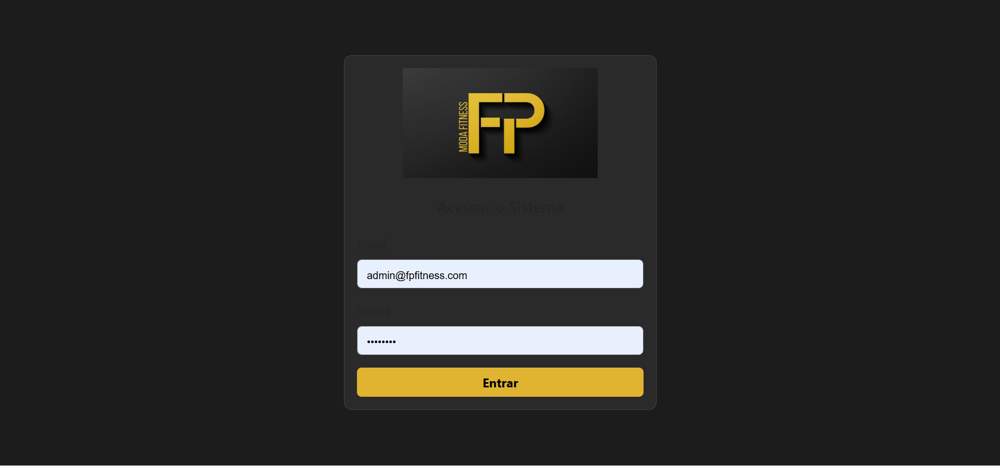
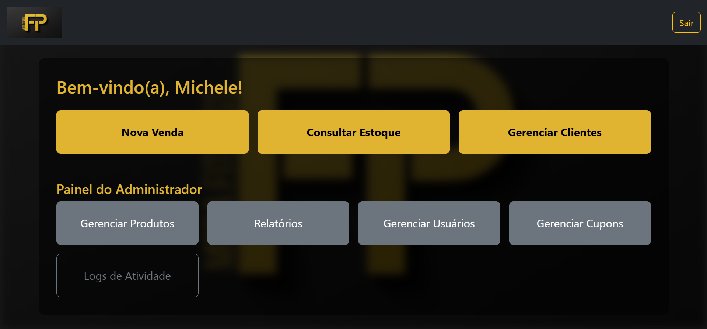
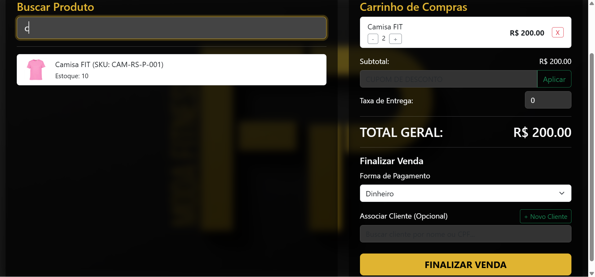
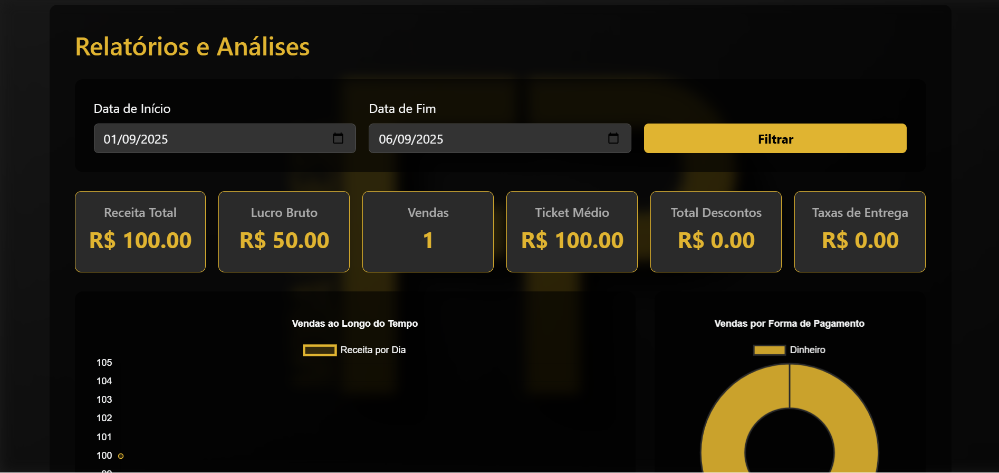

# Sistema FP Moda Fitness


Um sistema completo de Ponto de Venda (PDV) e Gestão de Estoque desenvolvido para atender às necessidades de pequenos negócios de varejo. A aplicação é construída com uma API RESTful em Flask (Python) e um frontend dinâmico em Vanilla JavaScript.

---

##  статус do Projeto

**Concluído e Funcional.** O sistema está pronto para ser implantado em um ambiente de produção local.

---

## 📸 Screenshots


| Tela de Login                                      | Painel Principal (Admin)                           |
| -------------------------------------------------- | -------------------------------------------------- |
|  |  |

| Ponto de Venda (PDV)                               | Relatórios e Dashboards                            |
| -------------------------------------------------- | -------------------------------------------------- |
|    |  |

---

## ✨ Funcionalidades Principais

O sistema é rico em funcionalidades para otimizar a gestão de uma loja:

*   **Autenticação Segura:** Sistema de login com JWT (JSON Web Tokens) e hashing de senhas (Bcrypt).
*   **Controle de Acesso por Cargos:** Dois níveis de acesso predefinidos: **Administrador** (acesso total) e **Vendedor** (acesso limitado ao PDV, estoque e clientes).
*   **Gestão de Produtos Completa:**
    *   CRUD (Criar, Ler, Atualizar, Deletar) de produtos.
    *   Upload de imagem para cada produto.
    *   Controle de estoque automático (baixa na venda, retorno no reembolso).
*   **Leitor de Código de Barras:**
    *   Uso de leitor USB para adicionar produtos rapidamente no PDV.
    *   Cadastro de produtos via leitor de código de barras.
    *   **Gerador de código de barras** integrado para produtos sem etiqueta, com salvamento da imagem.
*   **Ponto de Venda (PDV) Intuitivo:**
    *   Busca de produtos por nome ou SKU.
    *   Carrinho de compras dinâmico.
    *   Aplicação de cupons de desconto (percentual ou fixo).
    *   Cálculo de taxas de entrega.
    *   Suporte a múltiplas formas de pagamento, incluindo parcelamento no cartão.
    *   Geração de recibo em HTML e opção de impressão.
*   **Gestão de Clientes:** Cadastro e manutenção de uma base de clientes.
*   **Relatórios e Análises:**
    *   Dashboard administrativo com KPIs (Receita Total, Lucro Bruto, Ticket Médio).
    *   Gráficos interativos (Chart.js) para análise de vendas ao longo do tempo, formas de pagamento, e ranking de produtos/vendedores.
*   **Diário de Bordo (Logs de Atividade):**
    *   Registro detalhado de ações importantes no sistema (vendas, reembolsos, criação de produtos, logins, etc.) para auditoria e segurança.
*   **Backups Automáticos:** Script que executa backups diários do banco de dados e limpa arquivos antigos para garantir a segurança dos dados.
*   **Instalação Simplificada:** Scripts (`.bat`) que automatizam a criação do ambiente virtual e a inicialização do servidor, facilitando o uso por pessoas não-técnicas.

---

## 🛠️ Tecnologias Utilizadas

### Backend
*   **Python 3**
*   **Flask:** Microframework web para a construção da API.
*   **Flask-SQLAlchemy:** ORM para interação com o banco de dados.
*   **Flask-Bcrypt:** Para hashing seguro de senhas.
*   **PyJWT:** Para geração e validação de tokens de autenticação.
*   **Python-Barcode:** Para a geração de imagens de código de barras.

### Frontend
*   **HTML5**
*   **CSS3**
*   **JavaScript (Vanilla):** Para toda a interatividade, lógica de negócio e comunicação com a API.
*   **Bootstrap 5:** Framework CSS para criação de uma interface responsiva e moderna.
*   **Chart.js:** Para a visualização de dados e gráficos nos relatórios.

### Banco de Dados
*   **SQLite:** Banco de dados relacional leve e baseado em arquivo, ideal para aplicações locais.

---

## 🚀 Como Executar o Projeto

Siga os passos abaixo para configurar e rodar o sistema em sua máquina local.

### Pré-requisitos
*   **Python 3.10+** instalado. (Lembre-se de marcar "Add Python to PATH" durante a instalação).
*   **Git** instalado.

### Passos para Instalação

1.  **Clone o repositório:**
    ```bash
    git clone https://github.com/SEU-USUARIO/NOME-DO-REPOSITORIO.git "Sistema FP Fitness"
    ```
    *(Substitua `SEU-USUARIO/NOME-DO-REPOSITORIO` pelo link do seu projeto no GitHub)*

2.  **Navegue até a pasta do projeto:**
    ```bash
    cd "Sistema FP Fitness"
    ```

3.  **Crie o ambiente virtual:**
    ```bash
    python -m venv venv
    ```

4.  **Ative o ambiente virtual:**
    *   No Windows:
        ```bash
        venv\Scripts\activate
        ```
    *   No macOS/Linux:
        ```bash
        source venv/bin/activate
        ```

5.  **Instale as dependências:**
    ```bash
    pip install -r requirements.txt
    ```

6.  **Execute o script de inicialização:**
    ```bash
    python run.py
    ```
    *(Este script irá executar a rotina de backup e iniciar o servidor Flask)*

### Primeiro Acesso

1.  Após iniciar o servidor, abra seu navegador e acesse `http://localhost:5000/registrar-admin.html`.
2.  Preencha o formulário para criar a conta principal de administrador.
3.  Após a criação, você será redirecionado para a tela de login. Acesse `http://localhost:5000` e entre com as credenciais que você acabou de criar.

O sistema está pronto para ser utilizado!

---

## 📂 Estrutura do Projeto
/Sistema FP Fitness
|
├── frontend/ # Contém todos os arquivos de interface (HTML, CSS, JS, imagens)
| ├── css/
| ├── js/
| └── ... (outros arquivos .html)
|
├── backups/ # (Gerado) Armazena os backups do banco de dados.
├── barcodes/ # (Gerado) Armazena as imagens de códigos de barras.
├── recibos/ # (Gerado) Armazena os recibos de venda em HTML.
├── uploads/ # (Gerado) Armazena as imagens dos produtos.
├── venv/ # (Gerado) Pasta do ambiente virtual Python.
|
├── app.py # O coração da aplicação: servidor Flask, API e lógica de negócio.
├── run.py # Script principal para iniciar o sistema (setup, backup, server).
├── backup_manager.py # Lógica para criar e limpar backups do banco de dados.
├── estoque.db # (Gerado) O arquivo do banco de dados SQLite.
├── requirements.txt # Lista de dependências Python para o projeto.
├── manual.txt # Guia de instalação para o usuário final.
└── README.md # Este arquivo.


---

## 🗺️ Roadmap (Possíveis Melhorias Futuras)

Embora o sistema esteja completo, existem ideias para expansões futuras:

*   **Permissões Granulares:** Evoluir o sistema de cargos (Admin/Vendedor) para um sistema de permissões individuais, permitindo que um admin delegue tarefas específicas (como ver relatórios) para outros usuários.
*   **Filtros Avançados:** Adicionar filtros por data e por usuário na tela de Logs de Atividade.
*   **Controle de Caixa:** Implementar funcionalidades de abertura e fechamento de caixa.

---

## 👨‍💻 Autor

Feito por **Fernando Sérgio**.

*   GitHub: `https://github.com/Fezudo98?tab=repositories`
*   LinkedIn: `https://www.linkedin.com/in/fernando-s%C3%A9rgio-786560373/`
*   Instagram: `https://www.instagram.com/sergioo_1918/` 
---

## 📄 Licença

Este projeto está sob a licença MIT. Veja o arquivo `LICENSE` para mais detalhes.